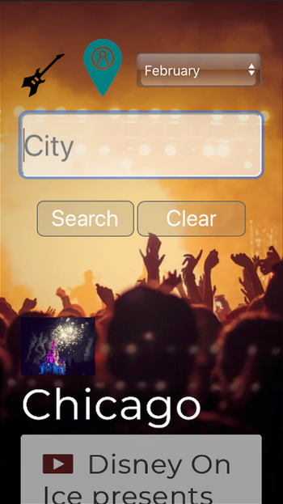
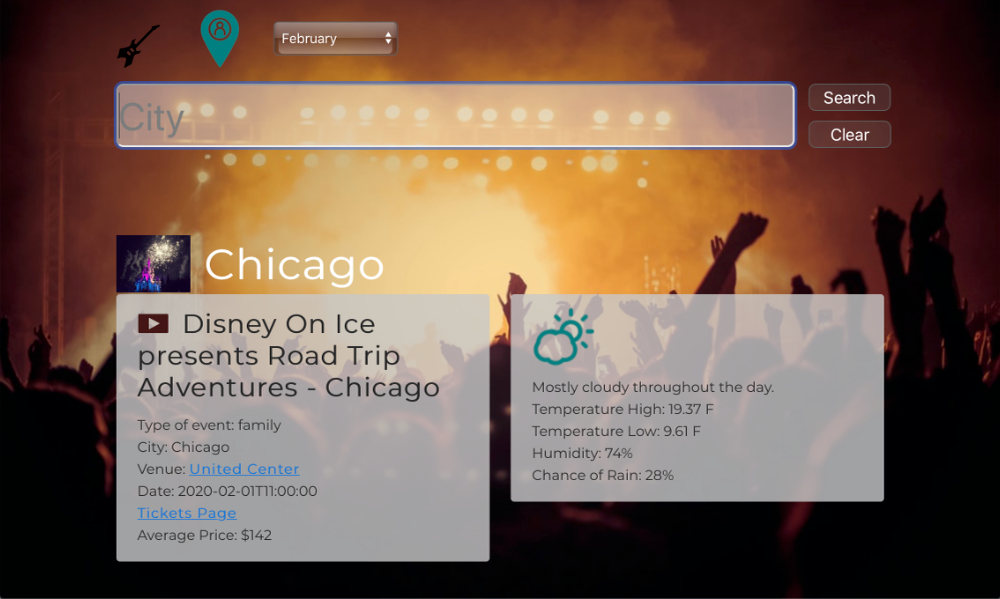
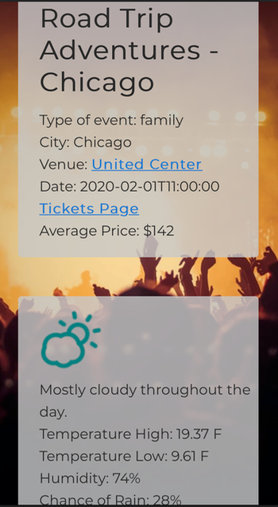

# This is LoCo
## a search for happenings now and upcoming  

We set out with the goal of building a simple and effective search tool for events - primarily in the music and sports area.  

Through the power of APIs we’re able to extend search beyond just musicians or just teams to a broader search of a wide array of events when exact matches aren’t found. We wanted the ability to easily search places we plan to visit  - beyond just our favorite band’s upcoming schedule.  

From a simple and intuitive search we can see who is playing or where our favorite band is going to be playing and see average tickets, weather forecast based on historical data, venue for the event, directly link to buy tickets.  

All this needed to be simple and uncluttered in an effort to provide a better mobile experience without downloading another app.

### Technology
Built with JS / JQuery, a slew of css, API from Dark SKy and Seat Geek.  
The front end JS was kept in the index file to pass to our events generating JS file. Location information was passed from the event API to the weather API query in order to pull data pairs and ensure mobile readable collapsing of columns. JS was kept compartmentalized to help reduced merge conflicts during development leading to initial deployment.

### Assignments
• Dave - Project managing, fullstack working with Pearl and helping backend with Bradley.  
• Bradley - Back end utilizing APIs from both Seat Geek and Dark Sky.  
• Pearl - Front end Designer.  
• Alexis - Back end Weather API using Dark Sky.  

  

